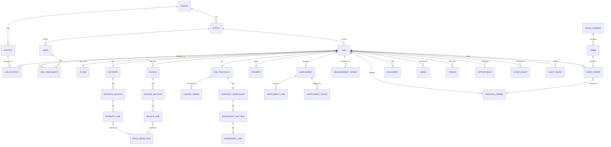

# 04 — Inferred Data Model

**Scope & method.** This document reconstructs AccuLynx's data model from public evidence only, and re-expresses it as the seed of **our** schema. Primary evidence is the public REST API teardown ([S-DATAMODEL-001], 282 schemas reconstructed from apidocs.acculynx.com) cross-checked against the twelve feature-inventory docs ([S-DATAMODEL-002..013]) and supplemental public checks made this pass ([S-DATAMODEL-014..021]). **Entity and field names below are our clean names**; where AccuLynx's observed name differs it appears as *(theirs: x)*. Anything not directly observed is marked **ASSUMPTION** (we invented it) or **INFERENCE** (deduced from observed behavior). Types: `uuid, str, bool, num, int, dt` (ISO-8601 UTC), `enum`, `[]`, `→` (reference). "Req" reflects observed create-endpoint requirements where known; `—` = not publicly knowable.

---

## 1. Entity catalog

### 1.1 Tenancy & people

**Tenant** *(theirs: company)* — fields from [S-DATAMODEL-001] §7.15 unless noted.

| Field | Type | Req | Notes | Ev |
|---|---|---|---|---|
| id | uuid | ✓ | appears as `companyId` on documents/external refs | [S-DATAMODEL-001] |
| name | str | ✓ | | [S-DATAMODEL-001] |
| timeZone | obj | ✓ | name, daylight name, base/adjusted UTC offset, DST flag | [S-DATAMODEL-001] |
| insuranceEnabled | bool | ✓ | *(theirs: hasInsurance)* — insurance features are a tenant-level toggle | [S-DATAMODEL-001] |
| branding | obj | — | logo/branding applied to portal + documents; shape unobserved (ASSUMPTION) | [S-DATAMODEL-011] |

**Office** *(theirs: location)* — multiple branch offices under one tenant [S-DATAMODEL-010]. Company-settings API is scoped "to the current location"; API keys, calendars, lead sources, account types, and country/state config are per-office [S-DATAMODEL-001][S-DATAMODEL-010]. Users pick an office at sign-in (default settable) [S-DATAMODEL-010]. Fields observed: none directly (settings ride on the key's office context) — model as `Office {id, tenantId→, name, settings…}` (ASSUMPTION on shape).

**User** *(theirs: user / companyUser)* — [S-DATAMODEL-001] §7.11, [S-DATAMODEL-010].

| Field | Type | Req | Notes | Ev |
|---|---|---|---|---|
| id | uuid | ✓ | | [S-DATAMODEL-001] |
| firstName, lastName, displayName, initials | str | ✓ | all three name fields required on their edit form | [S-DATAMODEL-010] |
| email | str | ✓ | doubles as permanent username | [S-DATAMODEL-010] |
| phone, mobilePhone | str | opt | | [S-DATAMODEL-001] |
| role | →Role | ✓ | single role per user (singular object in schema) | [S-DATAMODEL-001] |
| status | enum | ✓ | `Active, Inactive, Archived, Deleted`; billing follows status | [S-DATAMODEL-001][S-DATAMODEL-010] |
| permissionOverrides | obj | — | per-user overlay on role base permissions exists; shape behind 403'd help center (see §4) | [S-DATAMODEL-010] |

**Role** — fixed six-value taxonomy, integer ids *(theirs: Company Administrator, Location Administrator, Manager, Office, Sales, Crew)* [S-DATAMODEL-001]. No custom roles evidenced (INFERENCE from fixed enum) [S-DATAMODEL-010]. Our design: keep roles as data, not enum.

**ApiKey** — named, created per integration per office by admins; deactivatable; bearer token; no granular scopes surfaced (ASSUMPTION: full-surface access) [S-DATAMODEL-001][S-DATAMODEL-010].

### 1.2 Configuration lookups (tenant/office-scoped)

One compact row per lookup; all support active/inactive where noted. All from [S-DATAMODEL-001] §6/§7.15 unless noted.

| Lookup | Key | Fields | Notes |
|---|---|---|---|
| LeadSource | uuid | name, children[] {id, name, parentId}, isActive | two-level hierarchy (campaigns under a parent) [S-DATAMODEL-002] |
| JobCategory | int | name | |
| WorkType | int | name, systemDefault | e.g. an "Insurance" work type; system defaults + custom [S-DATAMODEL-006] |
| TradeType | uuid | name | many per job |
| ContactType | uuid | name, isDefault | many per contact |
| InsuranceCarrier *(theirs: insurance company)* | uuid | name, isActive | jobs may bypass with free-text custom name [S-DATAMODEL-006] |
| LedgerAccountType *(theirs: account type)* | uuid | name, isActive | buckets for outbound payments/expenses |
| DocumentFolder | uuid | name, description, companyId | folder taxonomy for job documents |
| MediaTag *(theirs: photo/video tag)* | uuid | name | admin-defined; tags replaced folders [S-DATAMODEL-013] |
| UnitOfMeasure | uuid | name, friendlyName | |
| MessageTag | — | name | admin-defined thread tags [S-DATAMODEL-009] — shape ASSUMPTION |
| AppointmentOutcome | — | name | configurable outcome categories (Spring 2026) [S-DATAMODEL-010] — shape ASSUMPTION |
| Country / State | int | name | platform-level, per-tenant enablement |

**CustomFieldDefinition / CustomFieldValue** — [S-DATAMODEL-001] §7.3. Definition: `{id, label, entityType enum[contact, job], fieldType enum[Text, Number, Date, Boolean] (+dropdowns via options[]), isActive, options[] {id, value, isActive, sortOrder}, audit}`. Value: `{customFieldDefinition→, values[] {id, value}}` — multi-value capable; text ≤500 chars; ≤120 fields per bulk write; value/status changes emit webhooks.

### 1.3 CRM

**Contact** — independent of jobs; one contact ↔ many jobs. [S-DATAMODEL-001] §7.2.

| Field | Type | Req | Notes | Ev |
|---|---|---|---|---|
| id | uuid | ✓ | | [S-DATAMODEL-001] |
| firstName, lastName, salutation | str | opt | | [S-DATAMODEL-001] |
| companyName, companyJobTitle | str | opt | commercial contacts | [S-DATAMODEL-001] |
| externalRef *(theirs: crossReference)* | str | opt | free-text external key | [S-DATAMODEL-001] |
| phones[] | [] | opt | `{number (10-digit), ext, type enum[Home, Mobile, Work], isPrimary, smsOptOut, textingCapable}` | [S-DATAMODEL-001] |
| emails[] | [] | opt | `{address, type enum[Personal, Work, Other], isPrimary}` | [S-DATAMODEL-001] |
| mailingAddress, billingAddress | addr | opt | create supports billing=mailing flag | [S-DATAMODEL-001] |
| contactTypes[] | []→ | opt | | [S-DATAMODEL-001] |
| lifetimeValue | num | — | computed; exposed only as a sortable search column (INFERENCE: derived rollup, not stored input) | [S-DATAMODEL-001] |

Children: **ContactActivity** *(theirs: contact log)* `{occurredAt, channel enum[PhoneCall, SMS, Email], description ≤1000, createdBy→}` — offline-touch log, also written by the CallRail integration with duration/recording/tags [S-DATAMODEL-001][S-DATAMODEL-009]; **ContactNote** `{note ≤1000, audit}` [S-DATAMODEL-001].

**Job** — the central record. **A lead is not a separate entity**: it is the same job record at the earliest lifecycle stage, plus an assigned/unassigned flag [S-DATAMODEL-002][S-DATAMODEL-001]. (Their API exposes both `/leads/{id}/history` and `/jobs/{id}/history` prefixes; whether ids share one space is unknown — see Unknowns.)

| Field | Type | Req | Notes | Ev |
|---|---|---|---|---|
| id | uuid | ✓ | | [S-DATAMODEL-001] |
| jobNumber | str | auto | tenant-configurable numbering scheme | [S-DATAMODEL-001] |
| jobName | str | auto | display name | [S-DATAMODEL-001] |
| stage *(theirs: currentMilestone)* | enum | ✓ | see state machine §3; read-only via public API | [S-DATAMODEL-001] |
| stageEnteredAt *(theirs: milestoneDate)* | dt | ✓ | | [S-DATAMODEL-001] |
| priority | enum | ✓ | `Normal, High, Urgent` | [S-DATAMODEL-001] |
| assigned | bool | ✓ | unassigned queue is a first-class filter; dead leads revert to unassigned | [S-DATAMODEL-014][S-DATAMODEL-002] |
| siteAddress *(theirs: locationAddress)* | addr | opt* | street1/city/state/country/zip required if present on create | [S-DATAMODEL-001] |
| geoLocation | obj | opt | lat/lng; drives radius search (km) and map assign | [S-DATAMODEL-001] |
| jobCategory, workType | → | opt | | [S-DATAMODEL-001] |
| tradeTypes[] | []→ | opt | multiple trades per job; trade tags flow into estimate/worksheet/invoice lines | [S-DATAMODEL-001] |
| leadSource | → | opt | | [S-DATAMODEL-001] |
| lostReason *(theirs: leadDeadReason)* | str | opt | set when marked dead | [S-DATAMODEL-001] |
| initialAppointment | obj | opt | `{startDate, endDate, notes}` — distinguished first appointment, own CRUD | [S-DATAMODEL-001] |
| leadScore | num | — | *(theirs: Lead Rank)* AI score on Lead/Prospect stages, third-party-data derived, read-only; scale unpublished | [S-DATAMODEL-002] |
| customFieldValues[] | [] | opt | | [S-DATAMODEL-001] |
| createdAt, modifiedAt | dt | ✓ | modified = last touched; "last touched" drives follow-up filters | [S-DATAMODEL-001][S-DATAMODEL-002] |

Create requires only a contact reference; new jobs land at stage Lead, unassigned [S-DATAMODEL-001].

**JobContact** (join) — `{jobId→, contactId→, isPrimary, relationToPrimary str}`; several contacts per job, one primary (drives invoicing recipient + greetings); primary changes emit webhooks [S-DATAMODEL-001][S-DATAMODEL-002].

**JobAssignment** *(theirs: job representatives)* — `{jobId→, userId→, slot enum[CompanyRep, SalesOwner, ArOwner, Additional]}`; three named slots plus extras; only one user per slot (a documented customer complaint — our model should allow teams) [S-DATAMODEL-001][S-DATAMODEL-002].

**Claim** *(theirs: job insurance + adjuster block)* — 0..1 per job [S-DATAMODEL-001] §7.10.

| Field | Type | Req | Notes | Ev |
|---|---|---|---|---|
| carrier | →InsuranceCarrier | opt | XOR free-text customCarrierName | [S-DATAMODEL-001][S-DATAMODEL-006] |
| claimNumber | str | opt | | [S-DATAMODEL-001] |
| claimFiled + claimFiledDate | bool, dt | opt | flag must be true if date set | [S-DATAMODEL-006] |
| dateOfLoss, damageLocation | dt, str | opt | | [S-DATAMODEL-001] |
| paperworkCollected *(theirs: hasPaperwork)* | bool | opt | | [S-DATAMODEL-001] |
| adjuster | obj | opt | `{name, email, fax, phone{number, ext, type}}` — one per job | [S-DATAMODEL-001] |
| metWithAdjuster + date | bool, dt | opt | inspection-meeting outcome | [S-DATAMODEL-001] |
| claimApproved + date | bool, dt | opt | | [S-DATAMODEL-001] |

No ACV/RCV/depreciation/deductible fields observed anywhere public — we design that structure ourselves (see Unknowns) [S-DATAMODEL-006].

**Calendar / Appointment** — Calendar `{id, name}` per office. Appointment: `{title, start, end, allDay, kind enum[Personal, InitialAppointment, MaterialDelivery, CrewLabor], attendees[]→User, jobId→, location, notes, sharedWithPortal bool, outcome→ (configurable, Spring 2026)}` [S-DATAMODEL-001][S-DATAMODEL-010].

**Task** — `{assignee→, priority, dueDate, notes, sourceRef (message | automation | manual)}`; assignee notified; no public API — shape beyond these fields ASSUMPTION [S-DATAMODEL-004][S-DATAMODEL-009].

**Thread / Message** *(theirs: job messages)* — per-job threaded board: `{message, replies[], mentions[]→User, tags[]→MessageTag, pinned, mutedBy[], reactions[], editedMarker, deletedMarker}`; API create-only (comment + reply) [S-DATAMODEL-001][S-DATAMODEL-002]. **TextMessage** — two-way SMS from a tenant-local number, auto-attached to job, automated sends annotated with their trigger [S-DATAMODEL-009]. **EmailMessage** — outbound-only from platform, template-based, logged to job; no inbound capture evidenced [S-DATAMODEL-009].

### 1.4 Sales & estimating

**Estimate** — many per job, one primary; public API read-only [S-DATAMODEL-001] §7.5, [S-DATAMODEL-018].

| Field | Type | Req | Notes | Ev |
|---|---|---|---|---|
| id, jobId→ | uuid | ✓ | | [S-DATAMODEL-001] |
| title, description, notes | str | opt | | [S-DATAMODEL-001] |
| estimateNumber | str | auto | auto-increments; manually overridable | [S-DATAMODEL-001] |
| isPrimary | bool | ✓ | primary drives worksheet/financials | [S-DATAMODEL-001][S-DATAMODEL-003] |
| marginRate/marginTotal | num | opt | *(theirs: profitMarginRate/Total)* | [S-DATAMODEL-001] |
| rollup | obj | auto | `{taxRate, taxTotal, overheadRate, overheadTotal, profitRate, profitTotal, totalCost, totalPrice}` — same shape reused per section | [S-DATAMODEL-001] |
| sections[] | [] | | `{title, description, marginRate/Total, rollup, items[], audit}` | [S-DATAMODEL-001] |
| audit | | auto | createdBy/at, modifiedBy/at | [S-DATAMODEL-001] |
| lifecycleStatus | — | — | draft/sent/viewed/signed **not observed** in public schema — design ours fresh (ASSUMPTION) | [S-DATAMODEL-003] |

**EstimateLine** *(theirs: estimate section item)* — the richest line-item shape in their model [S-DATAMODEL-001]:

| Field | Type | Notes |
|---|---|---|
| name, overrideName, description | str | overrideName = display alias |
| kind | enum | `SKU, Product, CustomSKU, Labor, SKUAndLabor` — the price-book taxonomy |
| materialCost, laborCost | num | split costs per line |
| wastePct *(theirs: waste)* | num | per-line waste factor grossing up measured qty [S-DATAMODEL-005] |
| estimateUnit, orderUnit, unitConversion, selectedUnit | | dual-unit model (1=Order, 2=Estimate) — estimating is wired to ordering |
| quantity, measuredQuantity, orderQuantity | num | three parallel quantities: from report / estimated / ordered [S-DATAMODEL-005] |
| price, totalPrice, fixedPrice | num, bool | fixed vs calculated pricing |

**PriceBookItem** — never exposed directly; existence proven by `referenceId: uuid` + `referenceType enum[SKU, Product, CustomSKU, Labor, SKUAndLabor]` on invoice lines and the same kind enum on estimate lines [S-DATAMODEL-001]. Populated from (a) supplier catalogs and (b) a contractor-defined "custom materials library" available at all tiers [S-DATAMODEL-007]. Internal shape ASSUMPTION; our design: `PriceBookItem {id, kind, sku, name, unit(s), materialCost, laborCost, defaultWastePct, supplierRef?, active}`. Related evidenced entities: **SupplierCatalogItem** (product/SKU, description, color, unit, branch stock; searchable by supplier item code) and **AccountPrice** (contractor-and-branch-specific, refreshed daily) [S-DATAMODEL-007][S-DATAMODEL-021]. **EstimateTemplate** — reusable estimate with pitch-based labor-rate rules (Spring 2026); quantity-formula internals unpublished [S-DATAMODEL-003].

**MeasurementOrder / MeasurementSet** — [S-DATAMODEL-005][S-DATAMODEL-001] §7.13.

| Field | Type | Req | Notes |
|---|---|---|---|
| id | uuid | ✓ | returned by both public POSTs |
| jobId→ | uuid | ✓ | |
| provider | enum | ✓ | API: `Unknown, Hover, RoofSnap, External`; native UI providers: EagleView, GAF QuickMeasure, Geospan |
| providerOrderId | str ≤40 | ✓ | |
| description | str ≤500 | ✓ | |
| latitude, longitude | num | ✓ | |
| files | multipart | opt | measurement file (XML/JSON), report PDF, ≤10 misc PDFs |
| model3DUrl | uri | opt | shareable 3D-model link |
| orderedAt, completedAt | dt | ✓/opt | |
| status | enum | — | UI tracker: `Requested, Ordered, Completed`; failure states unobserved |

MeasurementSet payload: roof fields (steep/low-slope areas, perimeter, ridges, hips, valleys, rakes, eaves, drip edge, flashing, step flashing, parapets, penetration area/perimeter, primaryPitch, pitchBreakdown[]) + wall/siding fields (wallArea, window/door area+perimeter, tops/bottoms of walls/siding/masonry, corner counts) [S-DATAMODEL-005]. No public read endpoint — stored schema unverifiable.

**DocumentTemplate / Packet / SignatureRecord** *(theirs: SmartDocs)* — template with merge fields pulling job-record data (multi-estimate capable for tiered proposals); packet = ordered grouping of pages/docs shareable by link; signature record captures `{name, email, date, time, ip}` with reminder + expiration settings; signed copy auto-files to job [S-DATAMODEL-003][S-DATAMODEL-011]. Internal template shape ASSUMPTION.

### 1.5 Money spine

Money lives in three parallel section/line structures — estimate → contract worksheet (+ amendments) → invoices — sharing nested line shapes and price-book references, plus a three-way payment ledger [S-DATAMODEL-001] §9.

**JobFinancials** — exactly one per job: `{id, jobId→, approvedJobValue (contract value), balanceDue, sectionTotals (across worksheet + amendments)}` [S-DATAMODEL-001]. Worksheet hangs off it: `GET /financials/{id}/worksheet` [S-DATAMODEL-019]. Approved-value changes emit a webhook [S-DATAMODEL-001].

**ContractWorksheet** *(theirs: financial worksheet)* — one per job; auto-populates from the primary estimate; approval-gated before invoicing [S-DATAMODEL-017][S-DATAMODEL-008]. `{id, jobId→, state str (values unpublished), title, totalPrice, sections[]}`. **WorksheetSection** `{sectionType enum[Worksheet, Invoice, Work Not Doing, Supplements, Discounts, Upgrades, Change Order, Insurance Claim], totalPrice, items[]}` — section types mirror insurance-restoration mechanics [S-DATAMODEL-001]. **WorksheetLine** `{itemName, description, quantity, unitOfMeasure→, costPerUnit, cost, price, totalPrice, parentItemId (nesting), hierarchySortOrder, tradeId→}` [S-DATAMODEL-001]. **ChangeOrder** *(theirs: amendment)* — worksheet-shaped deltas `{state, title, totalPrice, sections[], audit}`; typed per the section list above [S-DATAMODEL-001][S-DATAMODEL-006].

**Invoice** — [S-DATAMODEL-001] §7.7, [S-DATAMODEL-008].

| Field | Type | Notes |
|---|---|---|
| id, jobId→ | uuid | |
| invoiceNumber, invoiceName | str | number + user-entered name |
| sequence, sortIndex | num | creation order / display order |
| invoiceDate, dueDate, createdAt | dt | dueDate derived from terms |
| state | enum | `Draft, Unpaid, Paid, Void`; A/R aging starts on send; void emits webhook; marking paid stops aging [S-DATAMODEL-017] |
| totalPrice, balanceDue | num | per-invoice balance |
| accountingRecordingStatus, recordingClassification | str | booking state into QuickBooks/Sage + user classification |
| sections[] | [] | same type enum as worksheet sections |
| lines[] | [] | `{itemName, price, totalPrice, parentItemId, hierarchySortOrder, ledgerAssignment, priceBookRef {referenceId, referenceType}, tradeId}` |

Creation modes (UI only; no public create API): full worksheet / selected sections / N-installment sequence / manual lines [S-DATAMODEL-008].

**Payment** — one table, three directions *(theirs: Received Payment, Paid Payment, Additional Expense)* [S-DATAMODEL-001] §7.8.

| Field | Type | Notes |
|---|---|---|
| id, jobId→ | uuid | payments attach at **job** level, not invoice (allocation rule unknown) |
| direction | enum | `CustomerPayment, VendorPayment, Expense` (our naming) |
| amount | num | signed — negative adjustments allowed |
| method | str | e.g. Check, Credit Card, ACH, Wire |
| counterparty | str ≤250 | *(theirs: from / to)* |
| refNumber / checkNumber | str ≤50 | |
| paymentDate / transactionDate | dt | time component discarded (midnight UTC) |
| isPaid | bool | vendor payments + expenses only |
| ledgerAccount *(theirs: accountTypeId)* | → | vendor payments + expenses only |
| surchargeFee | obj | `{amount, percentage, description}` |
| convenienceFee / convenienceFeeRefund | obj | `{amount, description, source}` / `{amount, description, date}` |
| originSystem *(theirs: system)* | enum | `AccuPay, QuickBooks Online, QuickBooks Desktop, Sage Intacct` — read-only provenance |
| parentId, isParent | uuid, bool | sub-payment nesting |

Rollup **PaymentOverview** per job: `{salesAmount, balanceDue, arAgeDays, percentCollected}` [S-DATAMODEL-001]. **AccountingSyncStatus** per job: `{state enum[RequestedSync, Synced, NotSynced, Disconnected, None], syncDate, syncLocation}` [S-DATAMODEL-001][S-DATAMODEL-008].

**Supplement** (insurance) — [S-DATAMODEL-001] §7.9, [S-DATAMODEL-006].

| Field | Type | Notes |
|---|---|---|
| id, jobId→, name | | name = description |
| state | enum | `Created, InProgress, Closed, Applied, Deleted` (+`Unknown`) |
| statusRef | → | separate tenant-configurable status label (defaults Requested/Completed + custom intermediates) |
| assignedSupplementer | obj | `{user→, assignedDate, assignedBy→}` — dedicated ownership |
| totals | obj | originalClaim / requested / approved / applied |
| lines[] | [] | `{name, description, originalClaimAmount, requestedAmount, approvedAmount, appliedAmount}` — four-stage money lifecycle per line |
| touches[] *(theirs: notations)* | [] | `{statusRef→, spokeWith, phone, ext, fax, email, notes, emailRecipients[]→User, createdBy/at}` — carrier-negotiation call log |
| audit | | created/edited/closed/applied, each by+date |

Applied amounts post into the worksheet's Supplements section [S-DATAMODEL-006].

**Peripheral money objects** (no public API; shapes are marketed field lists — treat as partial): **Permit** `{jobId→, type, paymentAmount, status enum[drafted, applied for, pulled, posted, scheduled for inspection, completed]}` [S-DATAMODEL-006]; **MortgageCheck** `{jobId→, companyName, amount, sentDate, trackingNumber, status}` [S-DATAMODEL-006]; **Commission / PreCommission** `{repId→, jobId→, status enum[ReadyToRequest, Requested, Approved, Paid]}` [S-DATAMODEL-008]; **FinancingApplication** `{jobId→, prequalDecision, offers, fundingState, notifications}` [S-DATAMODEL-008].

### 1.6 Production

**CrewCompany / Crew** *(theirs: labor contact — sub managing crews, or single crew)* — `{name, trade→, colorCode, active, availability, complianceDocs[] (insurance proof, contracts, licenses), crewAppAccess {scope, expiresAt} (time-boxed), invitationState (SMS invite)}` [S-DATAMODEL-004][S-DATAMODEL-010]. No public API; field list from marketing/help evidence — partial.

**WorkOrder** *(theirs: labor order → labor ticket)* — approving a labor order auto-issues a ticket to the crew lead [S-DATAMODEL-004]. Evidenced content: `{jobId→, crew→, startDate, endDate, siteAddress, instructions, contacts, documents[], photos[], checklist→, linkedMaterialOrderId→, acceptState (accept/reject, sub can reassign among own crews), calendarEventKind: CrewLabor}` plus **CheckEvent** `{type in|out, at, gpsCoordinates}` from the Crew App [S-DATAMODEL-013]. Order statuses, approval flow, and pay amounts unpublished — the split between "order" (internal approval object) and "ticket" (crew-facing projection) is INFERENCE; our design collapses to one WorkOrder with a status field.

**MaterialOrder** — `{jobId→, supplier (ABC | SRS | QXO | free-text), branch, deliveryDate (→ calendar event kind MaterialDelivery), instructions, lines[] {product→SupplierCatalogItem, quantity, price}, attachments[], status (blog copy names pending / in progress / completed; scheduled vs unscheduled; supplier callbacks update it), podPhotos[] (auto-filed to Documents), supplierInvoiceData (ABC), linkedWorkOrderId→}` [S-DATAMODEL-007][S-DATAMODEL-004]. No public API; full status enum per supplier unpublished.

**ChecklistTemplate / ChecklistItem** — attached to workflow statuses and to work orders; completion stamps who + when; reusable standard templates [S-DATAMODEL-004][S-DATAMODEL-017]. Shape ASSUMPTION beyond `{label, completedBy→, completedAt}`.

### 1.7 Content, automation & events

**Document** — `{jobId→, file, description, folder→DocumentFolder, externalId, externalSource}`; executables blocked, filenames sanitized; write-only via API (no download endpoint) [S-DATAMODEL-001]. **Media** (photo/video) — `{jobId→, file | fileUri, description, tags[]→MediaTag, externalId, externalSource, annotations, locationStamp {gps, address, timestamp} (Jun 2026), quality}; albums: standard per job (homeowner/adjuster/crew, non-deletable) + custom; share links with expiration/revocation; video transcoded ≤720p` [S-DATAMODEL-001][S-DATAMODEL-013][S-DATAMODEL-011].

**AutomationRule** — `{name, trigger (job event | stage transition | order event | financing event), timingOffset (immediate or relative, e.g. N days before/after), action (templated email | SMS | task {assignee, dueDate, priority}), template + mergeTags, recipient, enabled}` [S-DATAMODEL-009]. Single trigger → single action; no conditions/sequences evidenced (INFERENCE).

**WebhookSubscription** — `{consumerUrl (HTTPS, immutable after create), status enum[enabled, disabled], techContact, topicNames[] (23 topics), integrationType enum[Api, Zapier]}`; delivery envelope `{topicName, eventDateTime, eventId, subscriptionId, event}`; at-least-once, 10s ack, auto-disable on repeated failure [S-DATAMODEL-001].

**AuditEvent** *(theirs: job/lead history)* — `{jobId→, action str (human-readable), domain enum (36 values incl. Permit, Commission, MortgageCheck, Financing, LaborOrder, JobPacket, TextMessage — a census of internal modules), date, createdBy→}` [S-DATAMODEL-001]. **StageEvent** *(theirs: milestone history)* — `{name, date}` per transition, plus current stage/status endpoints and change webhooks [S-DATAMODEL-001][S-DATAMODEL-015].

**Notification** — @Me feed items (assignment, stage changes, packet completions, measurement status, tasks), portal new-content notifications with configurable recipients/timing [S-DATAMODEL-009][S-DATAMODEL-010]. **PortalGrant** — homeowner access: invitation, phone-tied login, shared-item set, lastVisitAt, auto-expiry at job completion (INFERENCE: distinct grant/share entity; no public API) [S-DATAMODEL-011]. **ExternalReference** — generic third-party key map `{jobId, companyId, source, projectId}` [S-DATAMODEL-001]. **ScheduledReport / ReportRun / RunRecipient** — `{reportId, date, runInstanceId, recipientsCount}` / `{recipientId, files[] {fileId, fileUrl}}` [S-DATAMODEL-001][S-DATAMODEL-012].

---

## 2. Relationships

Cardinalities as evidenced; join entities in §1. Tenant 1:N Office; Office 1:N User (via role scope), Calendar, ApiKey, config lookups. Tenant 1:N Contact. Contact 1:N ContactPhone/Email/Activity/Note. Contact M:N Job via JobContact (one primary per job). Job N:1 Office (INFERENCE: keys pin office context). Job 1:N Estimate (one primary), Invoice, Payment, Supplement, MeasurementOrder, WorkOrder, MaterialOrder, Document, Media, Thread, Task, Appointment, AuditEvent, StageEvent, Permit, MortgageCheck; Job 1:1 JobFinancials; JobFinancials 1:1 ContractWorksheet, 1:N ChangeOrder; Job 0..1 Claim. Estimate 1:N Section 1:N Line; Worksheet/ChangeOrder/Invoice 1:N Section 1:N Line (self-nesting via parentItemId). Line N:1 PriceBookItem; Line N:1 TradeType. Supplement 1:N SupplementLine, 1:N SupplementTouch. WorkOrder N:1 Crew; CrewCompany 1:N Crew; WorkOrder 1:1 MaterialOrder (cross-link, optional). Payment self-references parentId. User 1:N JobAssignment (slots), Task, AuditEvent. AutomationRule/WebhookSubscription N:1 Tenant. [S-DATAMODEL-001..013]

---

## 3. Job lifecycle state machine

**States (evidenced).** Active spine: `Lead → Prospect → Approved → Completed → Invoiced → Closed` [S-DATAMODEL-001][S-DATAMODEL-002]. Off-ramps: `Dead` (lost lead/prospect, with reason, reverts to unassigned) [S-DATAMODEL-002]; `Cancelled` (appears in job payloads' stage enum) and `Deleted` (appears in the workflow-config enum) [S-DATAMODEL-001]. Their own spec is inconsistent: job payloads say `Cancelled`, config says `Dead, Deleted`, and the jobs-list filter accepts **both** `cancelled` and `dead` (not `deleted`) [S-DATAMODEL-014] — INFERENCE: Dead and Cancelled are distinct terminal states (lost-before-sale vs killed-after-approval) and Deleted is a hidden soft-delete excluded from list surfaces.

**Sub-statuses.** With custom workflows enabled (Elite tier), each stage holds an ordered set of tenant-defined statuses with checklists, variable by trade/category/work type; per-item completion is attributed who + when [S-DATAMODEL-015][S-DATAMODEL-017][S-DATAMODEL-020].

**Transitions.**

| From → To | Evidence |
|---|---|
| Each spine stage → next stage (one at a time; permission-gated "advance to the next Milestone") | [S-DATAMODEL-017] |
| Lead → Dead, Prospect → Dead (+ lostReason; job becomes unassigned) | [S-DATAMODEL-002][S-DATAMODEL-016] |
| Dead → active stage ("resurrect", permission-gated: office staff yes, sales no per customer report; landing stage unobserved — INFERENCE: returns to prior stage) | [S-DATAMODEL-016] |
| Approved/later → Cancelled | INFERENCE only (no public doc shows the trigger; deduced from enum split above) |
| Any → Deleted (soft delete) | INFERENCE from config enum + absence in filters [S-DATAMODEL-001][S-DATAMODEL-014] |
| Skipping stages forward / moving backward along the spine | Not evidenced either way — treat as unsupported until designed by us |
| Status → status within a stage (ordered progression; status change emits webhook) | [S-DATAMODEL-001][S-DATAMODEL-015] |

Every transition is timestamped into stage history, emits `job.milestone.current_changed` / `...status.current_changed` webhooks, and can fire automation rules; the public API cannot write transitions [S-DATAMODEL-001][S-DATAMODEL-009].

```mermaid
stateDiagram-v2
    [*] --> Lead : job created (always lands here, unassigned)
    Lead --> Prospect
    Prospect --> Approved
    Approved --> Completed
    Completed --> Invoiced
    Invoiced --> Closed
    Lead --> Dead : mark dead + reason
    Prospect --> Dead : mark dead + reason
    Dead --> Lead : resurrect (permission-gated; landing stage INFERENCE)
    Approved --> Cancelled : INFERENCE
    Completed --> Cancelled : INFERENCE
    Closed --> [*]
```

**Our design note.** Rather than three overlapping terminal enums, we model `stage` (spine only) + `outcome {won-in-progress | lost, lostAtStage, lostReason} ` + `deletedAt` — cleaner than copying their inconsistency.

---

## 4. Permission model (as evidenced)

**Structure.** Fixed role (1 per user) → role base permissions → per-user overlay of individual permission toggles; admins may change either at any time [S-DATAMODEL-010]. The concrete toggle list sits in bot-blocked help articles ("User Roles – Base Permissions", "Permission Settings") — unverified. Roles: two admin tiers (whole tenant vs one office) over Manager, Office, Sales, Crew [S-DATAMODEL-001].

**Evidenced permission points** (each is a discrete gate somewhere in the product):

| Gate | Evidenced behavior | Ev |
|---|---|---|
| Advance job stage | only permitted users can move a job to the next milestone | [S-DATAMODEL-017] |
| Resurrect dead lead | office staff can, sales staff cannot (customer report) | [S-DATAMODEL-016] |
| Worksheet approval | approvers vs submit-for-approval-only users | [S-DATAMODEL-010] |
| Financial visibility | per-user: hide job profitability while showing balance due; crews see task data only | [S-DATAMODEL-010] |
| Record scoping (Sales) | sales reps see only jobs assigned to them | [S-DATAMODEL-010] |
| Payment requests | AccuPay request initiation is permission-gated | [S-DATAMODEL-003] |
| Measurement ordering | per-role enablement observed (Geospan grantable to Managers/Office/Sales) | [S-DATAMODEL-005] |
| Email template admin | edit/copy/activate/delete requires manager or administrator | [S-DATAMODEL-009] |
| Sub/crew access | per-sub scope of visible job-file info **and duration** (time-boxed, auto-expiring) | [S-DATAMODEL-010] |
| API keys | created/named/deactivated by Company or Location Administrators only; key = per-office bearer with no finer scopes (ASSUMPTION: full access) | [S-DATAMODEL-010][S-DATAMODEL-001] |
| 2FA enforcement | account-wide or per-user | [S-DATAMODEL-010] |
| Report identity | "preview as another user" implies row/column visibility varies by user | [S-DATAMODEL-012] |
| Homeowner (portal) | separate principal: phone-tied login, sees only staff-shared items, access auto-expires at completion | [S-DATAMODEL-011] |

**Our design note.** Their model = static roles + boolean overlays + hard-coded gates. We should ship permissions as data (policy sets attachable to roles/users), keep the evidenced gate list above as the minimum viable permission catalog, and add the two things customers visibly lack: multi-user job ownership [S-DATAMODEL-002] and admin-facing audit of settings/permission changes [S-DATAMODEL-010].

---

## Unknowns

Public sources could not reveal the following — we design these ourselves rather than guess AccuLynx's internals:

- **Write-hidden modules.** Material/labor orders, crews, tasks, checklists, permits, mortgage checks, commissions, financing, templates, price book internals, portal state, notification prefs have no public API; their true schemas are unknowable (field lists above are partial reconstructions from marketing/help snippets).
- **State machine edges.** Whether stages can be skipped or moved backward; exact Cancelled vs Dead vs Deleted semantics and triggers; resurrect landing stage; worksheet `currentState` and estimate lifecycle values.
- **Permission matrix.** The concrete toggle catalog and per-role base grants (help center returns HTTP 403 to non-browser clients; not circumvented per protocol).
- **Money edge cases.** Payment→invoice allocation across multiple open invoices; ACV/RCV/depreciation/deductible structure; retainage/deposits/credit memos; tax jurisdiction handling.
- **Identity & tenancy mechanics.** Lead-vs-job ID spaces (`/leads/{id}` vs `/jobs/{id}`); whether the office picker is hard data partitioning; multi-office user membership and per-office roles.
- **Template internals.** Measurement-field → line-quantity binding (formula language?), pitch-based labor tables, SmartDocs field types/conditionals.
- **Derived data.** Lead-score inputs/scale/refresh; contact lifetime-value computation; supplier price-sync mechanics (push vs pull; "real-time" vs "daily" claims conflict).
- **Access limits this pass.** support.acculynx.com and G2 remain bot-blocked (403); apidocs reference pages render only endpoint shells to non-browser fetchers (full schemas came from the OpenAPI fragments merged in [S-DATAMODEL-001]); YouTube watch pages bot-checked, so no video-timestamp UI evidence was added here.

Prepared under docs/legal/clean-room-protocol.md; all sources logged.
